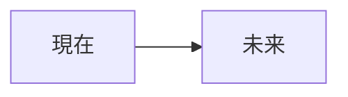
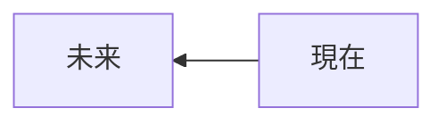
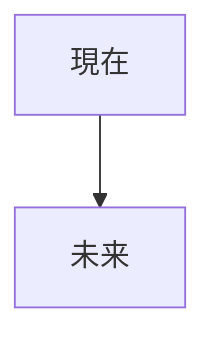
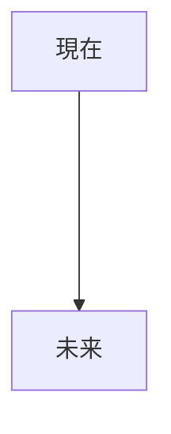
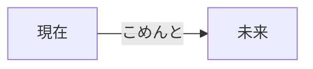
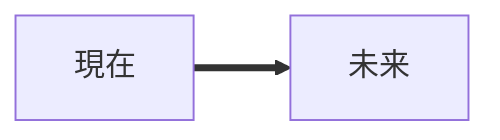

## マークダウン
ReadMeの作成やPullRequestの際のマークダウンについて学習したので、よく使うものをまとめておく

## 目次
* [見出し](#見出し)
* [リスト](#リスト)
* [チェックボックス](#チェックボックス)
* [コード](#コード)
* [リンク](#リンク)
* [詳細](#詳細)
* [marmeid](#marmeid)
* [table](#table)
* [参考文献](#参考文献)


## 見出し
コンテンツに区切ったり、題材を変えるときに使用。

```
# 見出し１
## 見出し２
### 見出し３
#### 見出し４
##### 見出し５
###### 見出し６
```
## リスト

箇条書きで使用。


```
- Hoge
    - hoge
    - hogehoge
- Fuga
    - fuga
    - fugafuga
```
- Hoge
    - hoge
    - hogehoge
- Fuga
    - fuga
    - fugafuga

こっちでもできる。

```
* Hoge
* Fuga
```
* Hoge 
* Fuga

## チェックボックス

x えっくす.　ばつじゃなかった。

```
* [x] checked
* [ ] no
```

* [x] checked
* [ ] no

## コード


```Java
public static void main (String[] args){
  System.out.println("hogehoge");
}
```

[```Java]みたいにすると、コードに色がつく


[`]で囲むと、その部分だけグレーになる

`このぶぶん`

## リンク

```
[表示する文字](URL)
```

[Googleさん](http://google.com)


## 詳細

```
<detail>

<summary>表示内容</summary>
詳細詳細詳細

</detail>

```

<details>

　　　<summary>　Hoge　</summary>

  hogehogehoge

</details>

## mermaid

フローチャートを描くのに便利。[```mermaid]で囲む。


```



LRが左から右

```

最後も[```]必要


RLは右から左

```

最後も[```]必要


上から下。

```

最後も[```]必要


[-]によって長さ調節

```

最後も[```]必要


コメントも


```

最後も[```]必要


=に変えると太線に。


## table

```
id|name|place|age
--|--|--|--
01|yamada|Tokyo|28
```

id|name|place|age
--|--|--|--
01|yamada|Tokyo|28


## 参考文献

https://mermaid-js.github.io/mermaid/#/./flowchart?id=flowcharts-basic-syntax

https://ryuta46.com/516

https://www.wakuwakubank.com/posts/861-git-markdown/


