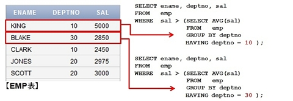
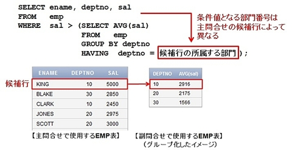
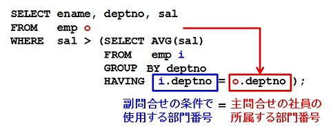

## 副問合わせ

> 副問合わせとは、関連するSQL文を1つにまとめて記述できる構文。

副問合わせには、SELECT句やWHERE句内で使用する**サブクエリ**と、FROM句で使用する**インラインビュー**が存在する。ここで記述しているのはサブクエリに関して。
インラインビューについては、下でまとめる。

### 例：全社員の平均給与よりも、給与が高い社員は誰か

```SQL
SELECT ename, sal
FROM   emp
WHERE  sal >= (SELECT AVG(sal)  
               FROM   emp);　　
```

WHERE句内で実行されるSELECTが１つの値を指定するので、それが主構文のWHERE句内の条件として書き換えられる。

## 相関副問合わせ

次に、**自分の所属する部署の平均給与よりも高い給与の社員はだれか**を考える。この場合、社員は所属する部署が異なるため、１人１人で検索する部署の平均給与が異なる。
その場合、先ほどの副問合わせでは、条件が上手く指定できない。この場合、今回の主題である相関副問合せを使用する。





これを１つのSQLで表現するときのイメージが次の画像





実際の構文



> 1.主問合せに指定されたEMP表から、1行を選択（候補行）
>
> 2.その人が所属する部門番号を特定
>
> 3.その人が所属する部門番号を使って、副問合せを実行（所属する部門の平均給与を求める）
>
> 4.所属する部門の平均給与と、候補行となっている社員の給与を比較し、社員の給与の方が高ければ、検索結果として選択
>
> 5.表の次の候補行に対しても、上記1から4の処理を繰り返す

## インラインビュー


参照：https://atmarkit.itmedia.co.jp/ait/articles/1208/06/news118.html
